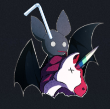
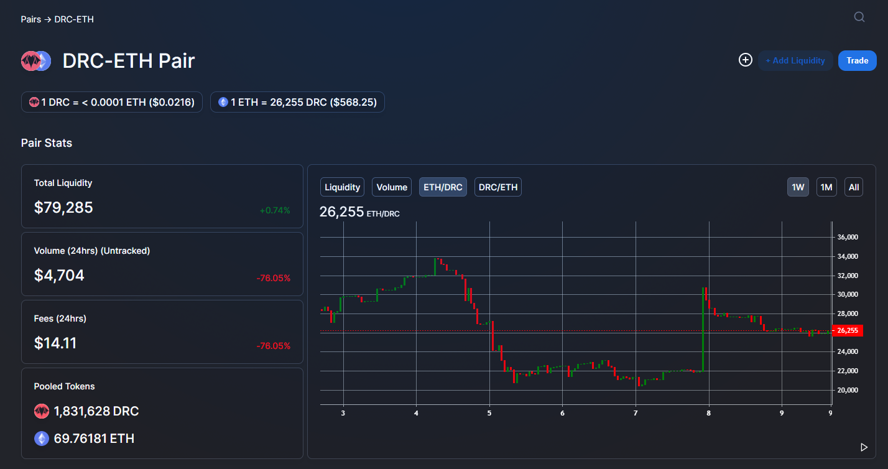
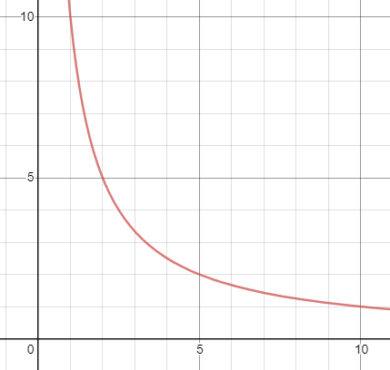
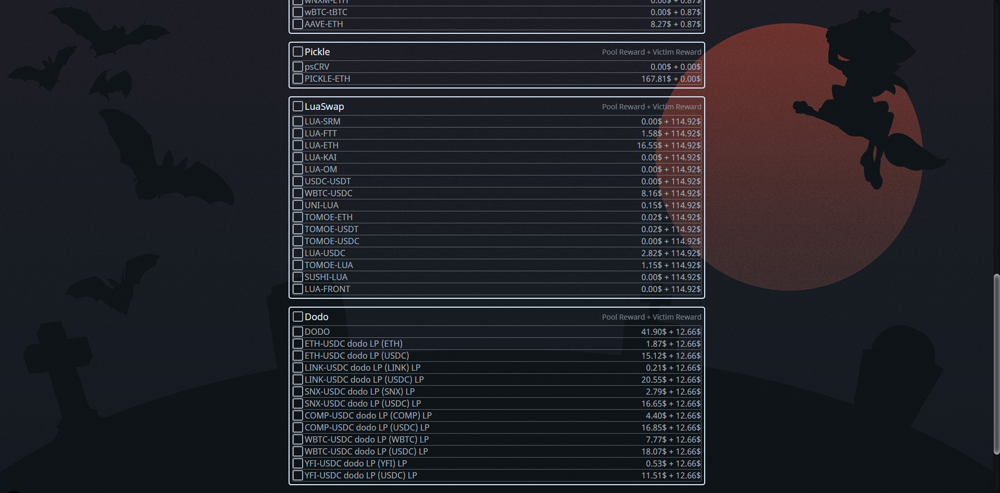
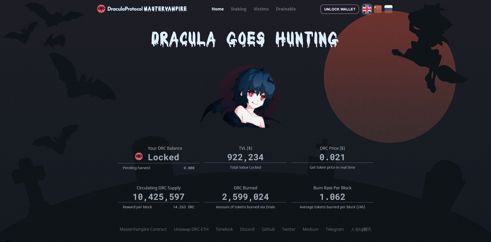

# Reverse Vampirism: Value Extraction from dracula.sucks Contracts

---

*An apt summary of the article*

## Introduction

[dracula.sucks](https://dracula.sucks/) is a deeply flawed project in the
Decentralised Finance (DeFi) world. From bad tokenomics to inexperienced
developers, the project has pivoted its core mechanics multiple times in a few
months, each time failing to solve its core issues. Despite that, it managed to
attract over $100 Million in Total Value Locked (TVL) at its peak, before
slowly losing investors and fizzling out. This article is not about the flaws
of Dracula, but about making money out of a dying project.

In October 2020, it was brought to my attention that it was possible to generate
a significant amount of money from the interaction of Dracula's smart contracts
on the Ethereum blockchain with the wider ecosystem, at very little personal
risk. In the following four days, I picked up the Solidity smart contract
programming language and the tools around smart contract development and
automation, starting from a state of zero knowledge, and ending in profit.
I had started the endeavour mostly out of personal interest, and to build a
foundation of knowledge for possible future projects, but actually making money
was a cherry on the figurative cake. Here, I will detail what went into the
effort, and share my knowledge gained. 

To understand how money was made, we must first understand the components that
made it possible.

## Mechanics

### Uniswap

Uniswap is the largest Automated Market Maker (AMM) in the Ethereum ecosystem.
How AMMs differ from traditional markets is in the method that asset pricing is
achieved. While traditional markets rely on an orderbook comprising buy or
sell orders from market makers, participants in an AMM can be thought of as
market makers with an infinite number of buy and sell orders at all prices.

Instead of buy or sell orders, prices of assets in an AMM are determined by the
ratio of assets in the pool. For example, if a pool had 100 ETH and 600,000
USDC, then 1 ETH = 600 USDC. This ratio is governed by the curve **X * Y = K**,
where K is a constant, and X and Y represent the amount of each asset in the
pool. When users make a trade, for example, selling X to buy Y, they deposit a
number of X tokens into the pool, and to maintain K, withdraw a number of Y
tokens from the pool. As more X tokens are sold into the pool, each additional Y
becomes more expensive, and vice versa. For Uniswap, there is also an additional
fee of 0.3% on each trade. This fee is shared among all 'liquidity suppliers' -
users who contributed both tokens to the pool, and are the analogous market
makers.

### Flash Loans

To simplify, flash loans allow anyone to borrow an arbitrary number of tokens
without collateral, as long as it is repaid in the same transaction with
interest.

Flash loans are a controversial topic in the DeFi world. On one hand, they have
enabled new mechanics such as easy loan refinancing at lower rates, but on the
other hand, they have broadened the range of common attack vectors when
exploiting smart contracts. The largest attack in 2020 was the [attack on
Harvest Finance for $24 million](https://coingeek.com/defi-project-harvest-exploited-for-over-24-million/).
Although the method used to achieve this attack, and [others such as this](https://www.coindesk.com/everything-you-ever-wanted-to-know-about-the-defi-flash-loan-attack),
was possible without flash loans, they have given anyone access to an effectively
unlimited amount of funds in specific circumstances.

For this project, I decided to go with [Aave](https://aave.com/flash-loans/) as
a provider of flash loans as they had provided an excellent tutorial with
provided templates (no longer available at the time of writing). Although there
was a 0.09% fee on flash loans while [DyDx](https://money-legos.studydefi.com/#/dydx)
has none, development speed was more important rather than minimising costs.

### Ethereum Transaction Mechanics

In Ethereum, transactions are, as the name implies, transactional. This means
that if the transaction fails for whatever reason, the entire transaction
reverts. For example, if a transaction makes a trade and fails later, the trade
never happened.

There are also gas costs to consider. Each transaction on the Ethereum chain
requires 'gas', an amount of ETH paid to the miner as a fee for including the
transaction in the block. With Ethereum as the dominant chain for DeFi, gas
costs have risen significantly in recent years (and months). Transactions that
used to have negligible costs are now measured in dollars. [Ethereum 2.0](https://ethereum.org/en/eth2/)
is supposed to solve this issue through switching to a Proof-of-Stake mining
mechanism and using sharding to scale the number of transactions, but it is
still a long time away.

### The 'Drain' Function

Everything is held together by the mechanic that Dracula uses to supposedly
return value to depositors. The Dracula MasterVampire contract includes a
publically callable function that harvests reward tokens earned from users,
and sells them to buy DRC tokens (the native Dracula token) to burn (decrease
the total supply). Remember how each time a token is bought in a Uniswap pool,
its price rises? This function effectively gave anyone a "pump the DRC price"
button, which could result in significant changes in the DRC token's worth.

The worst part about this is that it's a feature, not a bug. The developers of
Dracula explicitly put this into the contract and opened it up to the public.
This is why I do not hesitate to put out this article, as it is definitely not
an exploit. In the next section, I will provide details on how the pieces of
this puzzle fit together.

## Putting It All Together

We have the drain function, which I can use to raise the price of DRC tokens
at any time. If I buy DRC tokens from its Uniswap pool before that, I would make
a profit selling it afterwards, provided the amount drained is large enough. To
obtain DRC tokens, I could use Aave flash loans to borrow ETH to buy DRC, and
repay it with my profits.

The final piece of the puzzle is considering fees. If
I borrow more ETH, I pay more fees. If I buy more DRC, I pay more fees, and
with inflated DRC prices, the drains are less effective. The more pools I drain
from, the more I spend in gas costs. Putting it all together, it is possible to
construct a mathematical formula that calculates the optimal amount of DRC to
buy to maximise profits. That is left as an exercise to the reader, and to
discourage script kiddies from effortlessly replicating this in other projects.

The result is a smart contract that does the loan, DRC buying, DRC pumping, and
DRC selling process, and an external script that monitors the blockchain to
execute the contract when the profitability reaches a certain threshold. Initial
versions of the contract were rudimentary with a few failed starts. The first
contract (my first ever) was deployed three days after my first Google search
for "Solidity", and I reached profitability after day 4. At that point in time,
the entire process was mostly manual work. A few days later, most processes were
hands-off, with scripts running 24/7. The final contract is provided in
this repository for reference, but I do not include the surrounding JS code for
obvious reasons.

I was not the first to utilize this method of income generation. Although I knew
that it was possible when I first researched the project, I only realised how
profitable it could be when someone in the Dracula discord posted about how much
he was making. Perplexingly, that person is now a moderator. Before us, there
were actors making much more when Dracula was at its peak, measurable in
multiple ETH per hour, taking away as much as 1/3 of total value from investors.

We will never know why the developers of Dracula made the project so
weak by putting in a public drain function. Most other projects with
similar mechanics limit the button to only trusted sources. In theory, with
enough actors, the profitability of performing this would tend towards zero,
with almost all value returned to investors. In reality, there are only a few
people in the world capable of carrying it out, and the overlap of these people
with people watching the Dracula project is small. It is likely that this was a
case of developers biting off more than they could chew. The people behind the
Dracula project are likely inexperienced, with no economic and game theory
mindset that is almost a prerequisite to be a contributing part of the DeFi
world. It is likely that Dracula only rose to prominence as a fluke, as it was
entirely unsustainable and collapsed soon after peaking.

## Defeating Defences

At some point in the project's life, the developers put in defences in the
contract code limiting the amount that the DRC token's price could be raised
above a previously recorded price. This piece of code limited the amount of DRC
that someone could buy before pushing the drain button, limiting the value
taken away from investors. Although this code was not put into action for much
of October, it was eventually put into use at the end of the month. Getting
around this is an easy task: Simulate the amount bought and sold, and if the
price went above the peg, decrease the amount bought and try again. Although a
mild nuisance, it sometimes limited the amount of value that was possible to
extract.

It was also possible to manipulate the price peg as updating it was a public
function. Calling it took the average price of DRC between now and the last time
it was called, with a minimum of one hour between calls. It was thus possible
to favourably set the peg by updating it when DRC price was high, and to
simulate updating the peg before contract execution, to check if it would
result in more value.

## Tools Used

### Truffle

[Truffle](https://www.trufflesuite.com/) is the main smart contract development
and testing tool. It allows unit testing and deployment of contracts, and easy
automation with Javascript.

### Ganache

[Ganache](https://www.trufflesuite.com/ganache) is for setting up a development
blockchain on which to test contracts. In this project, it was mainly used to
fork the Ethereum mainnet to simulate updating the price peg, then putting the
data into the main script. 

### Geth

[Geth](https://geth.ethereum.org/) is an Ethereum node run locally. As the
execution of the script required large amounts of data, and thus calls to
the blockchain, to gather information on how much value was drainable, my usage
was not sustainable with just using [Infura](https://infura.io/), the standard
free ETH node provider used by many Ethereum applications like Metamask. It also
provided reduced latency and allowed me to branch out to creating tools for
monitoring other Ethereum-based projects. After a few days without it, it became
clear that running a local node was crucial for this task. The only downside is
that it uses a lot of RAM, filling up the 16 GB that I had. Although the script
was fully automated, I was unable to do anything else at the same time. The
profits from this project have since paid for an upgrade to 32 GB.

## Conclusion

This project was a very successful first foray into the world of smart
contracts. While working on it, I successfully picked up the tools of the trade
and put them to use in only four days, despite not having read a line of
contract code before. It has opened up new avenues of automated income
generation through monitoring and execution, and given me the ability to
personally audit the contracts that I interact and choose to place my funds in.
The total amount of value extracted from Dracula is north of 7.75 ETH, or over
$4,300 USD at the time of writing.
